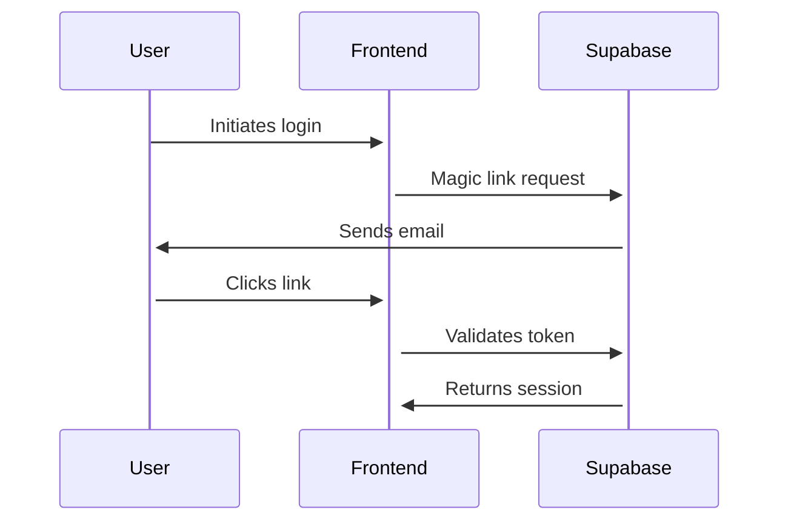

```markdown
# Implementation Notes

## Core Systems

### 1. SEO System

The SEO system consists of several key components:

#### Content Analysis
- Uses OpenAI GPT-4 for content optimization
- Analyzes blog posts, landing pages, and meta descriptions
- Provides keyword density and readability scores

#### Schema.org Implementation
```typescript
// Example Schema Implementation
{
  "@context": "http://schema.org",
  "@type": "LocalBusiness",
  "name": "SimplyMaid",
  "areaServed": [
    {
      "@type": "City",
      "name": "Sydney"
    }
    // ... other cities
  ]
}
```

#### Meta Tag Generation
- Dynamic generation based on page context
- City-specific optimizations
- Proper social media tags

### 2. Database Structure

#### Core Tables
```sql
-- Users
CREATE TABLE users (
  id UUID PRIMARY KEY,
  email TEXT UNIQUE,
  role USER_ROLE
);

-- Profiles
CREATE TABLE profiles (
  id UUID PRIMARY KEY,
  user_id UUID REFERENCES users(id),
  first_name TEXT,
  last_name TEXT
);

-- Bookings
CREATE TABLE bookings (
  id UUID PRIMARY KEY,
  customer_id UUID REFERENCES users(id),
  cleaner_id UUID REFERENCES users(id),
  status BOOKING_STATUS
);
```

### 3. Authentication Flow



## Configuration Management

### Environment Variables
Required variables:
```bash
# Database
POSTGRES_DATABASE_URL=postgresql://...

# Supabase
NEXT_PUBLIC_SUPABASE_URL=https://...
NEXT_PUBLIC_SUPABASE_ANON_KEY=eyJ...

# OpenAI
NEXT_PUBLIC_OPENAI_API_KEY=sk-...
```

### Feature Flags
```typescript
const FEATURES = {
  ENABLE_BLOG: true,
  ENABLE_BOOKINGS: true,
  ENABLE_SEO_TOOLS: true
};
```

## Deployment Considerations

### Database Migrations
1. Generate migration:
```bash
npm run db:generate
```

2. Apply migration:
```bash
npm run db:migrate
```

### Environment Setup
1. Configure Supabase project
2. Set up database connection
3. Configure OpenAI API access

## Performance Optimizations

### Bundle Size
- Implemented dynamic imports
- Optimized image loading
- Proper code splitting

### Database Queries
- Implemented connection pooling
- Added query caching
- Optimized joins and indexes

### SEO Performance
- Server-side rendering for critical pages
- Proper meta tag implementation
- Structured data validation

## Testing Strategy

### Unit Tests
```typescript
describe('SEO Analysis', () => {
  it('should analyze content correctly', async () => {
    const content = 'Test content';
    const analysis = await analyzeBlogContent(content);
    expect(analysis).toBeDefined();
  });
});
```

### Integration Tests
```typescript
describe('Booking Flow', () => {
  it('should create booking successfully', async () => {
    const booking = await createBooking({
      date: new Date(),
      service: 'regular-cleaning'
    });
    expect(booking.id).toBeDefined();
  });
});
```

## Security Measures

### Authentication
- Magic link authentication
- Role-based access control
- Protected API routes

### Data Protection
- Input validation
- SQL injection prevention
- XSS protection

## Monitoring

### Error Tracking
```typescript
async function trackError(error: Error) {
  await db.errors.create({
    data: {
      message: error.message,
      stack: error.stack,
      timestamp: new Date()
    }
  });
}
```

### Performance Monitoring
```typescript
async function trackMetric(name: string, value: number) {
  await db.metrics.create({
    data: {
      name,
      value,
      timestamp: new Date()
    }
  });
}
```

## Known Issues

1. SWC Compilation
   - Issue: SWC binary loading fails in WebContainer
   - Solution: Disabled SWC features and using standard compilation

2. Database Connection
   - Issue: Connection pooling in WebContainer
   - Solution: Implemented custom pooling configuration

3. Environment Variables
   - Issue: Inconsistent naming convention
   - Solution: Standardized all environment variable names

## Future Improvements

1. Performance
   - Implement Redis caching
   - Add service worker for offline support
   - Optimize image delivery

2. Features
   - Add real-time booking updates
   - Implement cleaner rating system
   - Add customer loyalty program

3. Security
   - Add 2FA support
   - Implement rate limiting
   - Add security headers

## Support and Maintenance

### Regular Tasks
1. Database backups
2. Security updates
3. Performance monitoring
4. Content updates

### Emergency Procedures
1. Database recovery
2. Service restoration
3. Security incident response

## Documentation Updates

### Required Updates
1. API documentation
2. Database schema changes
3. New feature documentation
4. Security procedures

### Review Process
1. Technical review
2. Security review
3. Documentation update
4. Team training
```